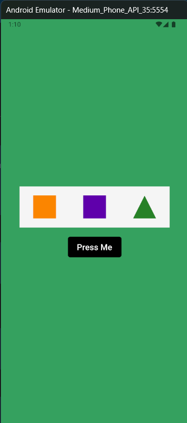
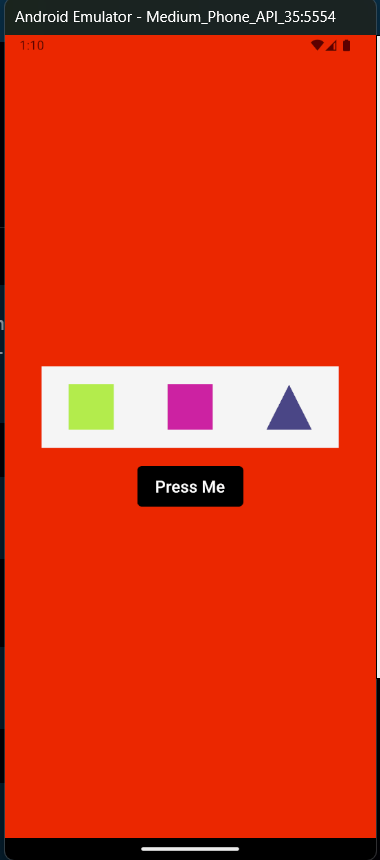

# 🎨 Random Color Generator App

## 📌 Project Info
A simple React Native CLI app that randomly changes the background color and shape colors when a button is pressed. 🎲✨

## 🖼️ Image
<div style="display: flex; flex-direction: row; gap: 10px;">
  
  
</div>

## 🛠️ Tech Stack
- ⚛️ React
- 📱 React Native
- 🏗️ React Native CLI
- 📝 TypeScript
- 🤖 Android Studio

## 🚀 Installation & Setup
1. 🔽 Clone the repository:
   ```sh
   git clone https://github.com/5ujay/React-Native/tree/main/Project04
   cd Project04
   ```
2. 📦 Install dependencies:
   ```sh
   npm install
   ```
3. ▶️ Run the app:
   - 📱 For Android:
     ```sh
     npx react-native run-android
     ```
   - 🍏 For iOS (Mac only):
     ```sh
     npx react-native run-ios
     ```

Thanks! 🎉🚀

